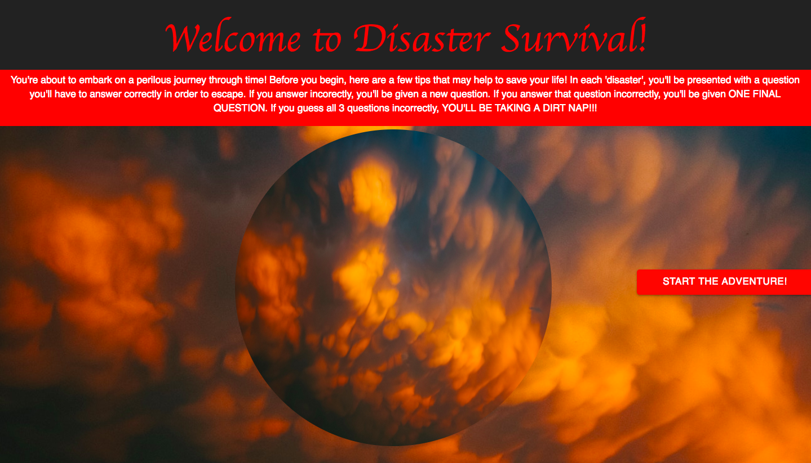
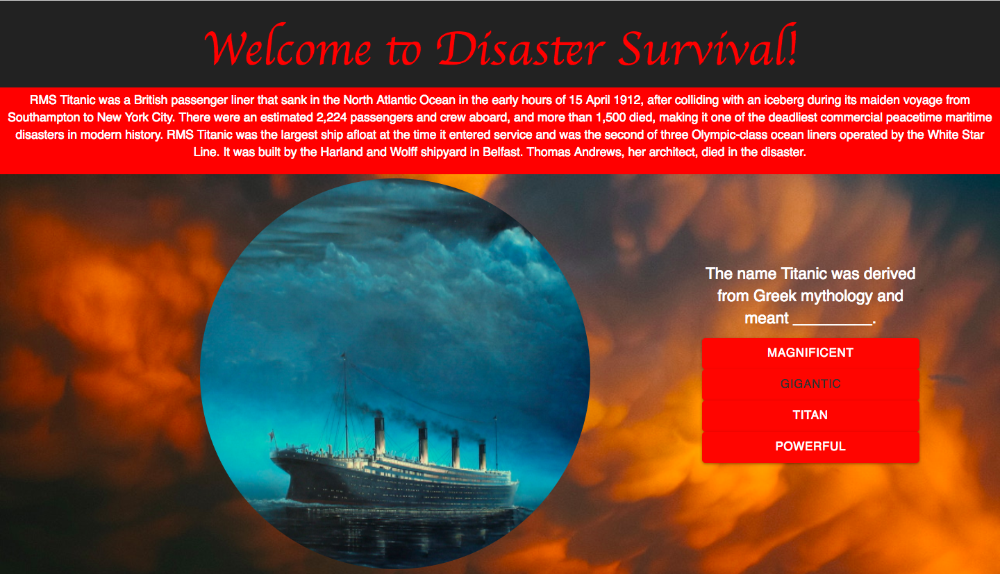
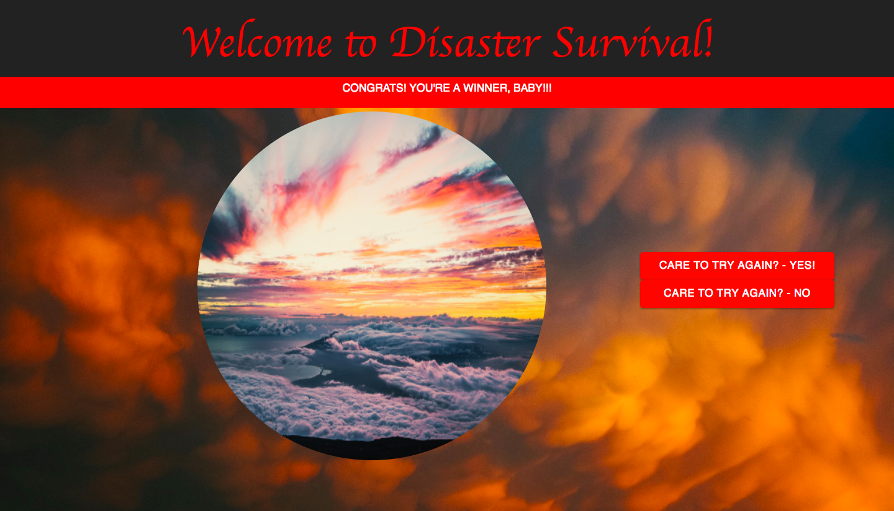
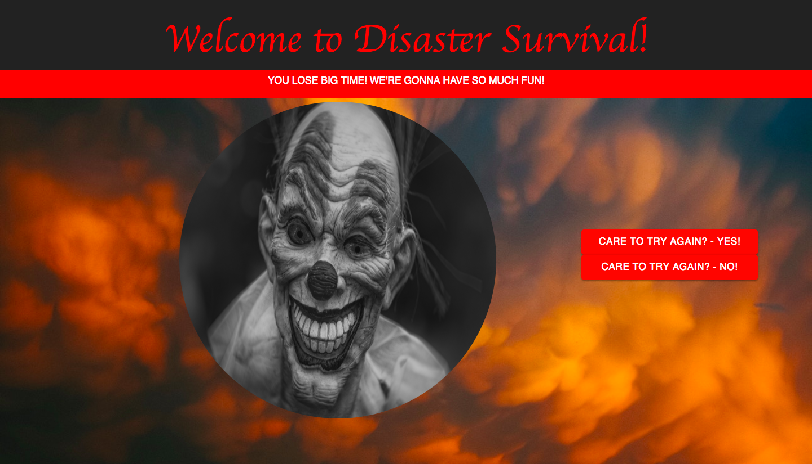

# Disaster Survival
### Developer - Preston Cropp 

The purpose of this application is to teach world history in a fun, interactive way. 

### Game play

Users are taken on a journey through time, passing through different world disasters. In each 'disaster', the user will be presented with a question that they will have to answer correctly in order to escape to the next time period. If they answer incorrectly, they will be given a new question. If that question is answered incorrectly, they will be given ONE FINAL QUESTION. If all 3 questions are answered incorrectly, THEY'LL BE TAKING A DIRT NAP!!!

### Example of questions and possible answers:

If the user makes it through all of the disasters, they will be greeted with a congratulatory screen and will be offered the opportunity, to play again to try and answer the questions they missed.

However, if the user makes it through all of the disasters, but fails to choose the correct answers, they'll be greeted with a "you lose" screen and will be offered the opportunity, to play again to try and answer the questions they missed.

